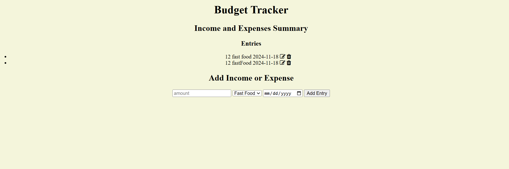

## Budget Tracker

 ## How It's Made:
 Tech used: EJS, CSS, JavaScript, Node.js, MongoDB

 This application is a budget tracker where users can add, edit and entries based off the catergory of the entry. It uses Node.js and Express.js for server-side logic. EJS templates handle front-end rendering, and MongoDB stores tasks and user data. 

## Installation

1. Clone repo
2. run `npm install`

## Usage

1. run `npm run savage`
2. Navigate to `localhost:7000`
